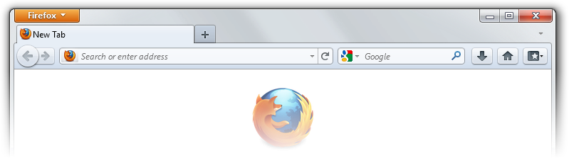

    
    <h6 align="center"><i>Bring back the "better Internet".</i></h6>
    

___

<h3 align="center">
<b>This rewrite of Echelon is a work in progress. Features may change and might not be fully functional.</b>
</h3>

  Echelon is a Mozilla Firefox (115-latest) theme that restores the look and feel of older versions.

  

## Installation
As this rewrite is still in the works, there are no releases for it yet. But, you can download compiled builds in [Github Actions](https://github.com/echelon-theme/echelon/actions). Download the source code no longer works as it only has the uncompiled SCSS files.

## Developers
* [Travis](https://github.com/travy-patty/)
* [aubymori](https://github.com/aubymori) 
* [Isabella Lulamoon](https://github.com/kawapure/)
