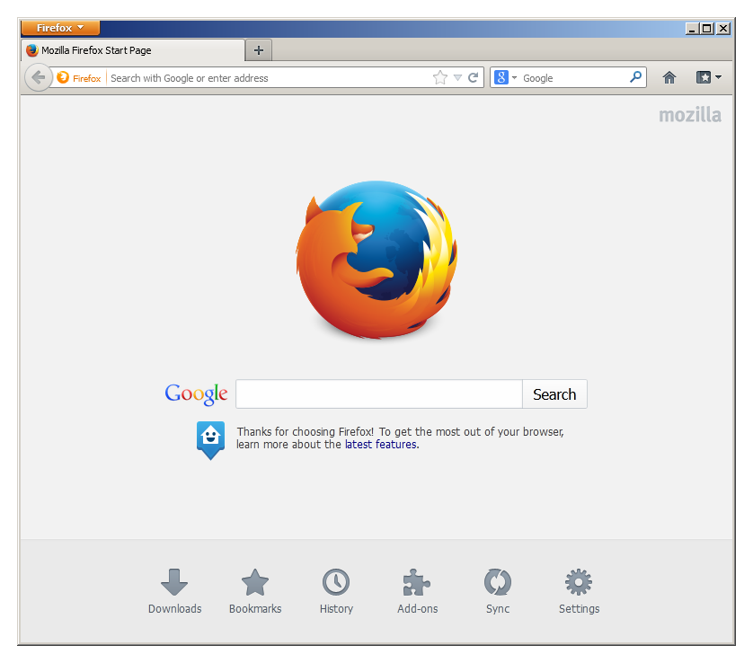

    
    <h6 align="center"><i>Bring back the "better Internet".</i></h6>
    

___

<h3 align="center">
<b>This rewrite of Echelon is a work in progress. Features may change and might not be fully functional.</b>
</h3>

  Echelon is a Mozilla Firefox (115-latest) theme that restores the look and feel of older versions.

  

## Coming from Echelon 1?
Echelon versions before release 2.0 is no longer supported. The update checker may display an error message, if you wish to continue using Echelon 1, disable update checks on the Echelon Options window.

## Screenshots
|  |  |
|---|---|
|  |  |

# Installation
Detailed instructions on how to install Echelon can be seen here:

[Instructions of installing Echelon](https://github.com/echelon-theme/echelon/wiki/Installation)

# Developers
* [Travis](https://github.com/travy-patty/)
* [aubymori](https://github.com/aubymori) 
* [Isabella Lulamoon](https://github.com/kawapure/)
