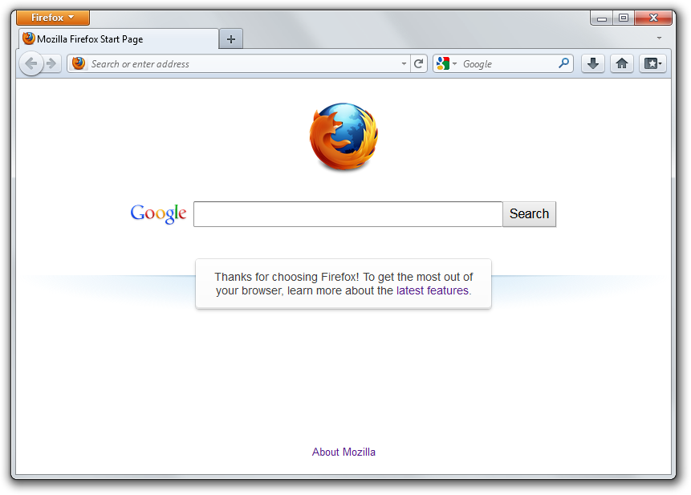
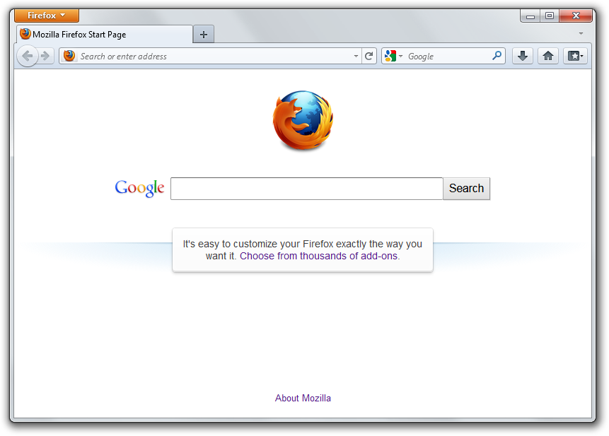
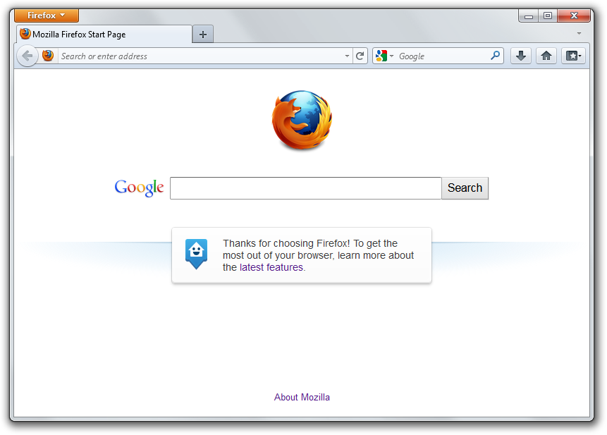
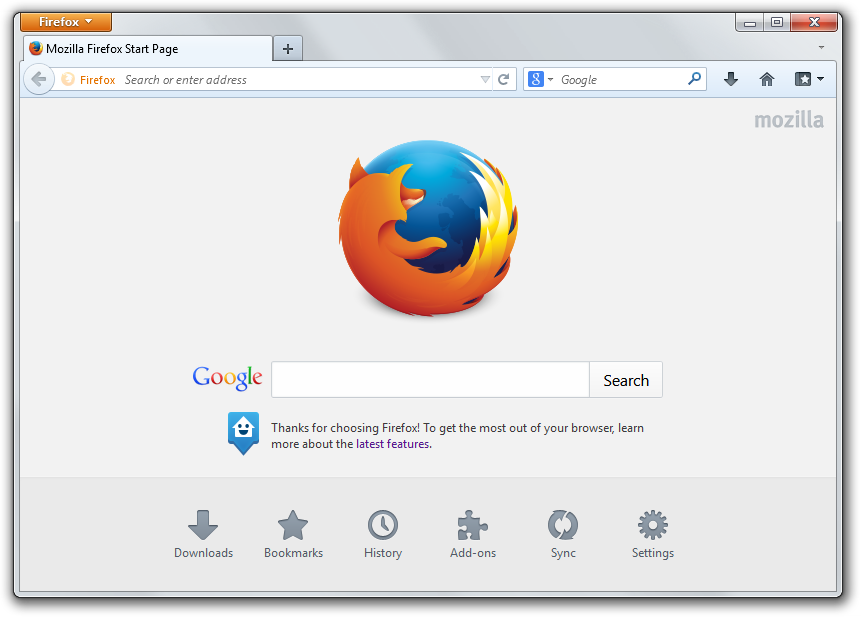
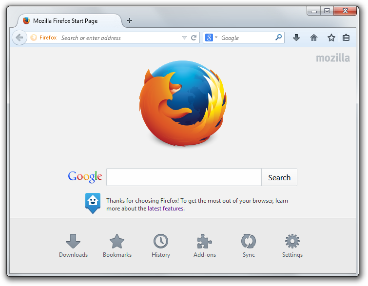

<h3></h3>
Bring back the "better Internet".

Echelon is a old Mozilla Firefox theme for Mozilla Firefox 115ESR.

## Screenshots
### Strata (Firefox 4)

### Strata (Firefox 5-9)

### Strata (Firefox 10-13)

### Strata (Firefox 14-28)

### Australis (Firefox 29)

## Credits
* Echelon was made by Travis
* Codebase port to SCSS, improvements, and Firefox Button by [ephemeralViolette](https://github.com/ephemeralViolette)
* Code improvement, Echelon Style 3 and Echelon Options window by [aubymori](https://github.com/aubymori)
* Echelon Private Testers
